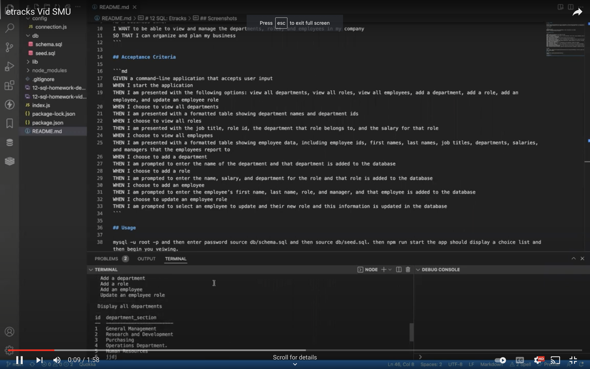

# 12 SQL: Etracks

## Summary 
This is a sequel-based application that allows non-developers to easily interact with databases. This app allows uses to npm run start and view tables and add or update databases and tables regarding employees, their roles and departments. This is an command-line application which also uses no node.js and Inquirer.

## User Story

```md
AS A business owner
I WANT to be able to view and manage the departments, roles, and employees in my company
SO THAT I can organize and plan my business
```

## Acceptance Criteria

```md
GIVEN a command-line application that accepts user input
WHEN I start the application
THEN I am presented with the following options: view all departments, view all roles, view all employees, add a department, add a role, add an employee, and update an employee role
WHEN I choose to view all departments
THEN I am presented with a formatted table showing department names and department ids
WHEN I choose to view all roles
THEN I am presented with the job title, role id, the department that role belongs to, and the salary for that role
WHEN I choose to view all employees
THEN I am presented with a formatted table showing employee data, including employee ids, first names, last names, job titles, departments, salaries, and managers that the employees report to
WHEN I choose to add a department
THEN I am prompted to enter the name of the department and that department is added to the database
WHEN I choose to add a role
THEN I am prompted to enter the name, salary, and department for the role and that role is added to the database
WHEN I choose to add an employee
THEN I am prompted to enter the employee’s first name, last name, role, and manager, and that employee is added to the database
WHEN I choose to update an employee role
THEN I am prompted to select an employee to update and their new role and this information is updated in the database
```

## Usage 

mysql -u root -p and then enter password source db/schema.sql and then source db/seed.sql. then npm run start the app should display a choice list and then begin you veiwing. 

## Links 

Github: https://github.com/Kristal4673/etracks.git
Youtube: https://youtu.be/U3EaZX4IZOg

## Screenshots 

